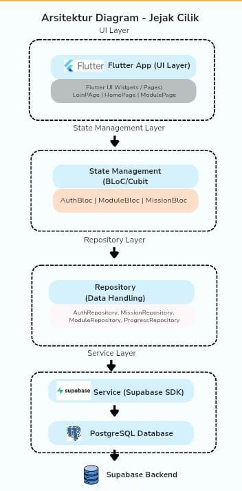

# 🐧 **JEJAK CILIK**
Jejak cilik is an educational mobile app based on SDGs 4 and SDGs 16. Targeting users aged 7 to 12, the app helps them learn through interactive learning modules, track their progress, and earn certificates upon completion.

The app was developed using Flutter with a Supabase backend.

---
# 🚀 **FEATURES**
The main feature of this app is interactive quiz-based submodule learning.

This app also includes mini-missions to keep learning engaging, especially with the streak feature🔥🔥🔥

In addition, there are several other features:
- photo album
- certificate
- progress bar or track record
- and others.

---
# 🛠️ **TECH STACK**
- Dart
- Flutter
- Supabase
- Google Auth

Jejak Cilik app uses a Mobile Frontend and Backend-as-a-Service (Baas) architecture with Flutter as the frontend and Supabase as the backend.

**Dart** is the programming language that builds this apps.

**Flutter** is a framework for building cross-platform mobile apps. It used to develop the entire apps interface (UI), manage page navigation, and connect to the backend.

**Supabase Flutter SDK** is the library for integrating Flutter with Supabase.

**Supabase** is the BaaS platform. It used as the main backend, providing database, API, auth, and storage service.

**Database PostgreSQL** is the relational database management system that used to store Jejak Cilik's data.

---
# 🏗️ **APPS ARCHITECTURE**



---

# 📈 **DATA FLOW**

Data flow in the apps:

User Interaction --> UI --> Provider/ViewModel --> Repository --> Service --> Supabase API --> PostgreSQL Database

---
# 🌐 **PLATFORM SUPPORT**

## ANDROID📱

Because the apps was developed using Flutter. And, almost everyone has a mobile phone, tho...

---
# ▶️ **HOW TO RUN THE PROJECT**

1. Clone Repository
   ```
   git clone https://github.com/Zeezoy/JEJAK-CILIK.git
   ```
3. Navigate to the Project Directory
4. Install Dependencies
   ```
   flutter pub get
   ```
6. Run Application
   ```
   flutter run
   ```

## BUILD APK

flutter build apk -release

---
# 🥇 **TEAM 8 RAION INTERNSHIP**

- Gerard  Bruened Pangaroan - _Product Manager_
- Mohammad Rahardian Atsil Qushoyyi - _Product Manager_
- Kania Khalifa Kurniadi - _UI/UX Designer_
- Lutfiatul Rofiah - _UI/UX Designer_
- Fevoura Agnesia Tatontos - _Mobile Engineer (Backend Focus)_
- Allyndra Dyalista Dardurani - _Mobile Engineer (Frontend Focus)_

---
# **DEVELOPED AS PART OF THE RAION INTERNSHIP 2026** 🦁🦁


